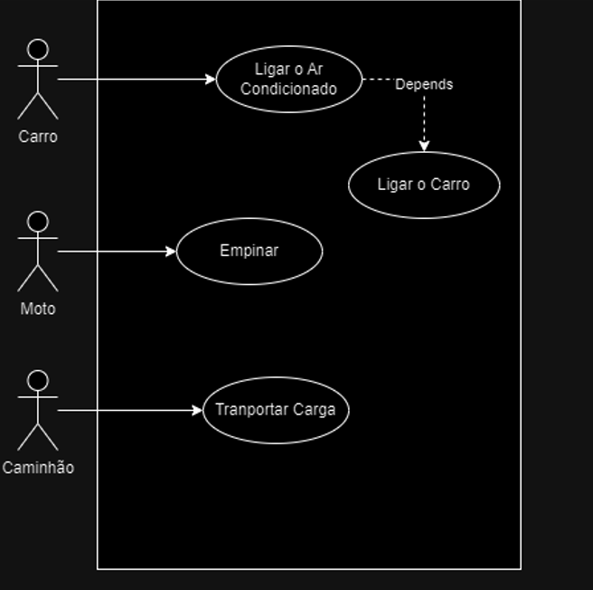
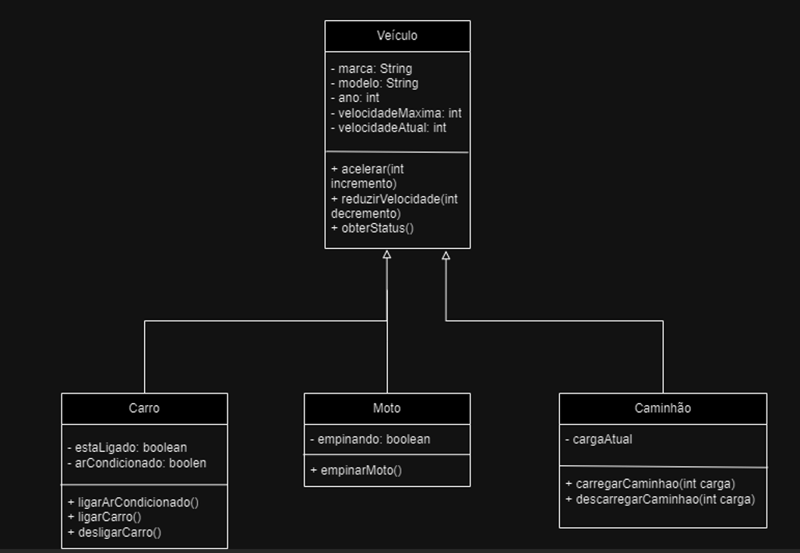

# Sistema de Gestão de Veículos - Correção em Classe :truck:
Correção feita em sala da atividade avaliativa aplicada como Checkpoint 2 para alunos do segundo ano de Engenharia de Software da FIAP.

## Documentação :memo: 

### Diagrama de Caso de Uso
Diagrama que ilustra as principais funcionalidades do sistema.

### Diagrama de Classe
Representação gráfica das classes, métodos e atributos desenvolvidos para a solução.

### [TBD] Instruções para execução do Sistema

- Execute o método main presente na classe [Main.java](src/main/java/Main.java)

### [TBD] Dependências do Projeto
    [ ] Maven
    [ ] Junit
    [ ] Java 8

### Colaboradores do Projeto
- Turma X - ES Paulista 
